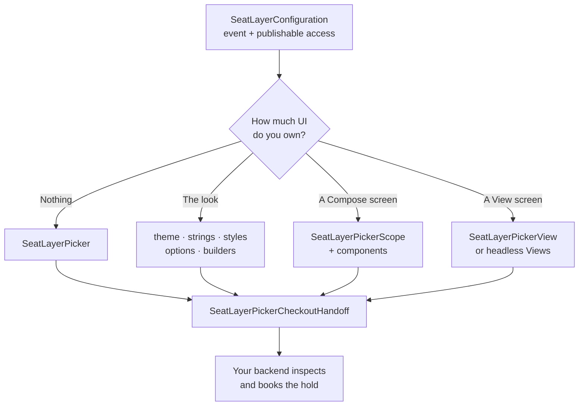

# SeatLayer Android Seat Map SDK for Reserved Seating

[](https://github.com/seatlayer/seatlayer-android/actions/workflows/ci.yml)
[](https://central.sonatype.com/artifact/io.seatlayer/seatlayer-android)
[](https://kotlinlang.org/)
[](https://developer.android.com/)
[](LICENSE)

The official SeatLayer Android SDK adds an interactive seating chart and native
seat picker to Kotlin ticketing apps. It renders live seat availability, creates
temporary holds, finds best-available seats, and exposes every buyer action
through typed Kotlin coroutines while your trusted server completes booking.
The ready-made picker and public components use Jetpack Compose, with View/XML
interop for existing Android screens.

Version `0.3.4` adds a complete adaptive Jetpack Compose picker, a
headless protocol-2 state/controller, reusable native Android components, and
View/XML interop while preserving the frozen raw `SeatLayerView` API.

[SeatLayer Android SDK on Maven Central](https://central.sonatype.com/artifact/io.seatlayer/seatlayer-android) ·
[Kotlin and Jetpack Compose seat-map guide](https://docs.seatlayer.io/buyer-sdk/android/) ·
[SeatLayer reserved-seating platform](https://seatlayer.io/) ·
[Buyer seat-map demo (web)](https://app.seatlayer.io/demo/play/grand-theatre) ·
[Native picker reference](docs/native-picker.md) ·
[0.2.x migration guide](docs/migration-0.3.md) ·
[Bridge reference](docs/bridge.md) ·
[SeatLayer iOS seat map SDK](https://github.com/seatlayer/seatlayer-ios) ·
[SeatLayer Flutter seat map SDK](https://github.com/seatlayer/seatlayer-flutter) ·
[SeatLayer React Native SDK](https://github.com/seatlayer/seatlayer-react-native) ·
[SeatLayer AI Toolkit](https://github.com/seatlayer/seatlayer-ai-toolkit)


> **Aligned release:** Use `0.3.5` for both Android artifacts. Pin the exact
> version in production so core and Compose cannot drift.

## Works as a native Android picker

**Every piece of buyer chrome is native Android UI.** The header, price legend,
floor and section navigation, accessibility filters, seat confirmation, tier
choices, quantity prompts, cart, hold countdown, checkout action, loading and
error states, plus the controls around 3D and panorama are Jetpack Compose
components. `SeatLayerPickerView` hosts that same native tree in a View/XML
screen, and the headless API also supports an entirely host-owned View layout.

The pinned SeatLayer renderer owns the pixels and gestures that only the venue
knows how to draw: seats, labels, section geometry, real venue 3D, and the
seat-view panorama. It knows native chrome owns the buyer journey, so it does
not place a second tooltip, cart, test badge, or checkout button underneath the
Android UI. This keeps chart behavior identical across SeatLayer platforms
without making the surrounding application feel like a generic web page.

The integration paths form a ladder. A more custom level keeps the same
inventory, snapshots, holds, lifecycle reconciliation, and secure checkout
handoff used by the ready-made picker.

| Level | You want | You use | You keep |
| --- | --- | --- | --- |
| **1** | The complete buyer flow | `SeatLayerPicker` | Adaptive Compose UI and everything below |
| **2** | The flow in your brand | Theme, strings, styles, options, or one of 25 builders | Stock layout, state, and hold ownership |
| **3** | Your own Compose screen | `SeatLayerPickerScope` plus public components | Inventory, controller, snapshots, lifecycle, checkout |
| **4** | A View/XML screen | `SeatLayerPickerView` | The same ready-made native picker without a Compose host screen |
| **5** | Your own Android Views | `SeatLayerPickerStateHolder` plus `SeatLayerPickerMapView` | The complete headless contract and map renderer |

`SeatLayerView` remains the low-level protocol-1 map for existing `0.2.x`
integrations that deliberately own all buyer chrome and hold orchestration.



## What is included

- `SeatLayerPicker`, the complete adaptive Jetpack Compose seat-booking flow.
- `SeatLayerPickerBuilders`, themes, strings, options, and per-part styles for
  changing the product without forking it.
- `SeatLayerPickerScope` and every stock component for a host-owned Compose
  hierarchy.
- `SeatLayerPickerView` for the same ready-made picker in View/XML apps.
- `SeatLayerPickerStateHolder`, `SeatLayerPickerController`, and
  `SeatLayerPickerMapView` for a fully headless or custom-View integration.
- The frozen `SeatLayerView` and raw coroutine controller used by existing
  `0.2.x` applications.
- Typed immutable snapshots, capability-gated commands, readiness and chart-load
  telemetry, secure holds, and buyer-safe checkout handoff.
- A hardened, origin-restricted AndroidX WebKit bridge with no unrestricted
  `addJavascriptInterface`.
- A pinned immutable `seatlayer-js@0.71.5/mobile.html` renderer.
- A generic sample covering ready Compose, branded/custom Compose, ready/custom
  View, and raw integrations.

## Packages

| Artifact | Use it for |
| --- | --- |
| `io.seatlayer:seatlayer-android` | Raw protocol-1 API plus protocol-2 headless state, controller, and map View. No Compose dependency. |
| `io.seatlayer:seatlayer-android-compose` | Ready-made picker, all native components, themes/styles/builders, and View/XML host. Strictly version-aligned with core. |

Both artifacts ship on the same release train.

## Requirements

- Android API 24 or newer; compile SDK 36
- JDK 17 for local builds
- AndroidX
- Android System WebView support for secure WebKit message listeners
- Document-start JavaScript support when using the protocol-2 native picker
- `android:enableOnBackInvokedCallback="true"` on picker activities when
  targeting Android 15 or lower and predictive-back animation is required

## Install

Add both aligned `0.3.5` artifacts for the native picker:

```kotlin
// app/build.gradle.kts
dependencies {
    implementation("io.seatlayer:seatlayer-android:0.3.5")
    implementation("io.seatlayer:seatlayer-android-compose:0.3.5")
}
```

```kotlin
// settings.gradle.kts
dependencyResolutionManagement {
    repositories {
        google()
        mavenCentral()
    }
}
```

Raw-only applications can omit `seatlayer-android-compose`.

Releases before `0.2.0` used JitPack coordinates
(`com.github.seatlayer:seatlayer-android:v0.1.3`). Maven Central is the permanent
channel. Always pin an exact version; never depend on `main-SNAPSHOT`.

## Ready-made native picker

```kotlin
class CheckoutActivity : ComponentActivity() {
    override fun onCreate(savedInstanceState: Bundle?) {
        super.onCreate(savedInstanceState)

        setContent {
            SeatLayerPicker(
                configuration = SeatLayerConfiguration(
                    event = "ev_your_event_key",
                    publicKey = "pk_test_your_key",
                    currency = "USD",
                    maxSelection = 6,
                ),
                modifier = Modifier.fillMaxSize(),
                onCheckout = { handoff ->
                    checkoutBackend.start(
                        holdId = handoff.holdId,
                        amount = handoff.total,
                        currency = handoff.currency,
                    )
                },
                onError = ::reportPickerError,
                onClose = ::finish,
            )
        }
    }
}
```

The default tree includes adaptive compact/wide layouts, native header and
legend, floors and sections, accessibility filters, confirmation, GA/table
quantities, dense cart, best available, checkout, 3D/seat-view controls,
hold-lapse recovery, light/dark branding, 37 locale dictionaries, lifecycle
reconciliation, and Android predictive back.

That is the complete buyer flow: loading and handshake, live inventory,
category and accessibility filtering, venue and floor navigation, visible
Adult/Child or other runtime-authored tier selection, reserved seats, general
admission and tables, cart and holds, expiry recovery, immersive views, and a
buyer-safe checkout handoff. Optional controls appear only when the negotiated
runtime advertises the capability they drive.

Register the exact renderer origin `https://cdn.seatlayer.io` on the publishable
key. For login-gated, presale, partner, channel, or other private inventory,
omit `publicKey` and use the renewable in-memory buyer-access provider shown
under [Checkout and security boundary](#checkout-and-security-boundary).

Give the picker a definite size and do not place the map in a scrolling list.
The canvas owns pan and pinch gestures.

Recomposition retains the active picker. Activity/process destruction creates
a new session; recover an existing hold by restoring its opaque id through
`SeatLayerPickerOptions(initialHoldId = ...)` and the same renewable
buyer-access provider. Verify that runtime-owned resume path with real
inventory, and never log the hold id.

## Customize or build your own UI

Three layers can be mixed without forking the SDK:

1. Pass `SeatLayerPickerOptions`, `SeatLayerPickerTheme`, localized
   `SeatLayerPickerStrings`, and `SeatLayerPickerStyles` to configure the
   ready-made picker.
2. Use `SeatLayerPickerBuilders` to decorate or replace any of 25 independent
   parts.
3. Use `SeatLayerPickerScope` and public components such as
   `SeatLayerPickerMap`, `SeatLayerPickerHeader`, `SeatLayerPriceLegend`,
   `SeatLayerConfirmCard`, and `SeatLayerPickerCartSheet` in a host-owned
   hierarchy.

```kotlin
SeatLayerPickerScope(
    configuration = configuration,
    callbacks = SeatLayerPickerCallbacks(
        onCheckout = ::openCheckout,
        onClose = onClose,
    ),
) {
    SeatLayerPickerLifecycle()
    SeatLayerPickerBackHandler()

    Column(Modifier.fillMaxSize()) {
        SeatLayerPickerHeader(onClose)
        SeatLayerPriceLegend()
        Box(Modifier.weight(1f)) {
            SeatLayerPickerMap(Modifier.fillMaxSize())
            SeatLayerPickerMapControls()
            SeatLayerConfirmCard()
        }
        SeatLayerPickerCartSheet()
    }
}
```

See the [native picker reference](docs/native-picker.md) for the full component
catalogue, builder context, per-part styling, localization fallback, mandatory
test/attribution disclosure, headless state guarantees, and custom View setup.

## View and XML applications

Use `SeatLayerPickerView` for the exact ready-made tree in an existing View
screen:

```xml
<io.seatlayer.android.compose.SeatLayerPickerView
    android:id="@+id/picker"
    android:layout_width="match_parent"
    android:layout_height="match_parent" />
```

```kotlin
binding.picker.bind(
    lifecycleOwner = this,
    configuration = configuration,
    onCheckout = ::openCheckout,
    onReady = ::observeReady,
    onSnapshot = ::observeSnapshot,
    onClose = ::finish,
)
```

For fully custom Views, bind a `SeatLayerPickerStateHolder` to
`SeatLayerPickerMapView`, collect its `state`, and invoke its typed `controller`.

## Existing raw map API

The `0.2.x` low-level surface remains available and independent from the native
picker:

```kotlin
class RawMapActivity : ComponentActivity() {
    private val scope = CoroutineScope(SupervisorJob() + Dispatchers.Main.immediate)
    private lateinit var seatMap: SeatLayerView

    override fun onCreate(savedInstanceState: Bundle?) {
        super.onCreate(savedInstanceState)
        seatMap = SeatLayerView(this)
        setContentView(seatMap)

        scope.launch {
            seatMap.controller.events.collect(::handleSeatLayerEvent)
        }
        scope.launch {
            seatMap.load(SeatLayerConfiguration(event = "ev_your_event_key"))
        }
    }

    override fun onDestroy() {
        seatMap.destroy()
        scope.cancel()
        super.onDestroy()
    }
}
```

`load` is a suspending function returning `ReadyInfo`: negotiated protocol,
event mode (`live` or `test`), transport, and event key. Await it before sending
commands. The SDK moves WebView work to the Android main thread internally.
Collect `controller.events` inside `repeatOnLifecycle` when a raw screen should
stop observation outside its active lifecycle.

`SeatLayerView` continues to negotiate protocol 1. The native picker uses a
separate protocol-2 profile, so adding Compose does not silently change an
existing raw integration. See the [Android 0.3 migration guide](docs/migration-0.3.md)
for dependency choices, lifecycle differences, and an adoption checklist.

### Hold seats with the raw API

Seat selection happens inside the map. A raw integration creates a short-lived
hold and transfers only its opaque id to the host backend:

```kotlin
scope.launch {
    val hold = seatMap.controller.hold(ttlMillis = 10 * 60 * 1_000)
    if (hold != null) {
        checkoutWith(
            holdId = hold.holdId,
            expiresAt = hold.expiry,
            items = hold.items,
        )
    }
}
```

`HoldResult.timeRemainingMillis` can drive a host-owned countdown. The backend,
not the app, inspects those hold items and decides the payable amount.

### Raw commands, events, and configuration

The coroutine controller covers holds, best available, general admission,
tiers, selection, categories, floors, view modes, and camera operations:

```kotlin
val controller = seatMap.controller

val seats = controller.getSelection()
val hold = controller.getCurrentHold()
controller.extendHold()
controller.release()

controller.bestAvailable(quantity = 4)
controller.holdGeneralAdmission(areaId = "floor", quantity = 2)
controller.setSeatTier(seatId = "A-12", tierId = "adult")
controller.selectObjects(listOf("A-12", "A-13"))
controller.setFloor("balcony")
controller.setViewMode(SeatLayerViewMode.Isometric)
controller.setColorblindSafe(true)
controller.zoomToFit()
```

The complete raw command surface is `hold` · `resumeHold` · `extendHold` ·
`release` · `releaseLabels` · `bestAvailable` · `holdGeneralAdmission` ·
`setSeatTier` · `getSelection` · `getCurrentHold` · `selectObjects` ·
`deselectObjects` · `clearSelection` · `selectCategories` ·
`deselectCategories` · `setSelectableObjects` · `setMaxSelection` ·
`getSelectionValidity` · `refreshAccess` · `getGeneralAdmissionAreas` ·
`getFloors` · `setFloor` · `setColorblindSafe` · `setViewMode` · `getViewMode` ·
`zoomIn` · `zoomOut` · `zoomToFit` · `destroy`.

Before using an additive raw command against an older renderer, inspect the
negotiated bundle capability. Unknown events remain available as
`SeatLayerEvent.Unknown`, and unknown value-class strings are preserved rather
than crashing an older application.

```kotlin
if (controller.bundle.value?.supportsCommand("bestAvailable") == true) {
    controller.bestAvailable(quantity = 2)
}
```

`controller.events` emits `SelectionChanged` · `SelectionValidityChanged` ·
`SelectionValid` · `SelectionInvalid` · `SelectionLimitReached` ·
`BuyerAccessExpired` · `BuyerAccessUnavailable` ·
`SelectedObjectsUnavailable` · `HoldChanged` · `HoldRestored` · `HoldExpired` ·
`GeneralAdmissionClicked` · `Hint` · `Error` · `SeatHovered` · `DeckTapped` ·
`Checkout` · `Unknown`. See the [bridge reference](docs/bridge.md) for the exact
command and event contract.

`SeatLayerConfiguration` accepts:

| Option | Purpose |
| --- | --- |
| `event` | Required public event key. |
| `apiBase` | Optional SeatLayer API endpoint override. |
| `publicKey` | Optional publishable SDK key; never provide a secret key. |
| `maxSelection` | Maximum buyer selection. |
| `selectedObjects`, `selectableObjects` | Initial selection and selectable allow-list. |
| `numberOfPlacesToSelect`, `selectionValidators` | Exact-count and adjacency/orphan rules. |
| `buyerAccessToken`, `buyerAccessTokenProvider` | One-shot or renewable private buyer access. |
| `locale`, `messages` | Locale and runtime message overrides. |
| `currency` | Buyer-facing currency. |
| `colorblindSafe` | Accessible palette preference. |
| `initialView` | Flat, isometric, or perspective view. |
| `showsWebSeatTooltip` | Enables the raw web-rendered tooltip; off by default. |
| `commandTimeoutMillis` | Per-command timeout; defaults to 15 seconds. |
| `handshakeTimeoutMillis` | Initial ready timeout; defaults to 30 seconds. |
| `hostInfo` | Extra host identification sent with the handshake. |

Private bearer values remain memory-only and are never placed in the page URL
or emitted through public diagnostics. The provider is called with a typed
reason (`initial`, `expiring`, `expired`, `unauthorized`, `reconnect`, or
`manual`); a provider failure is reported without leaking its exception message.

### Runtime and layout boundary

Both raw and native-picker integrations load the pinned
`https://cdn.seatlayer.io/seatlayer-js@0.71.5/mobile.html` document. Native and
web communicate through AndroidX WebKit messages restricted to the exact HTTPS
origin and main frame. File/content access, mixed content, popups, multiple
windows, automatic external navigation, and third-party cookies are disabled.
Renderer termination becomes a typed transport failure instead of a silent
blank screen.

The production path is the hosted `0.71.5` page. The
repository retains a verified `seatlayer-js@0.59.0` JavaScript fixture only for
deterministic legacy tests: `seatlayer/src/main/assets/seatlayer.js`, SHA-256
`89bc29fbccad5d3c30e52cf5381c974b95ac034b32c28b400248b4ebb4ee22a9`. The
fixture is not loaded by the production picker.

Give the map a definite height or make it full-screen. Do not place it in a
`ScrollView`, `NestedScrollView`, lazy list item, or another gesture-driven
container. The venue canvas owns tap, pan, pinch, panorama drag, and immersive
camera gestures; the SDK disables browser scrollbars, over-scroll, and built-in
WebView zoom controls that would compete with it.

## Checkout and security boundary

The app selects and holds inventory. A trusted backend inspects and books the
hold after payment or order validation.

- Never ship a SeatLayer secret key in the APK, WebView, or configuration.
- Pass only the opaque checkout `holdId` and normal order context to the backend.
- Calculate payable totals from server-inspected hold items, not app input.
- Reuse a stable order id as the booking reference for safe retries.

Private events should use a renewable in-memory provider:

```kotlin
SeatLayerConfiguration(
    event = "ev_private",
    buyerAccessTokenProvider = { context ->
        buyerBackend.mintSeatLayerBuyerAccess(context.reason)
    },
)
```

The SDK loads only the immutable
`https://cdn.seatlayer.io/seatlayer-js@0.71.5/mobile.html` page. Web messages are
restricted to the exact HTTPS origin and main frame; external navigation,
file/content access, mixed content, popups, multiple windows, and third-party
cookies are blocked. The bridge does not use `addJavascriptInterface`.

## Headless picker behavior

`SeatLayerPickerStateHolder.state` is a `StateFlow` of immutable snapshots and
native presentation state. `SeatLayerPickerController` provides serialized
suspending commands for selection, filters, floors/sections, view modes,
camera, GA/tables, holds, best available, lifecycle refresh, checkout handoff,
undo, back, and close.

Snapshots are accepted only for the configured event and current session, and
only at increasing revisions. Optional malformed fields are ignored without
discarding a valid snapshot; invalid schema/session/revision/event identity is
rejected. Empty UI appears only when the runtime gives affirmative sold-out or
all-unavailable evidence.

## Buyer journey and capability ownership

The ready picker and the public building blocks consume the same semantic
state. Custom hosts therefore do not lose typed tiers, immersive targets,
accessibility groups, hold ownership, retry state, or capability information.

| Buyer capability | Native Android owns | SeatLayer renderer/runtime owns |
| --- | --- | --- |
| Loading and readiness | Branded skeleton, progress hierarchy, retry/error UI | Document load, protocol handshake, ready snapshot |
| Failure and empty inventory | Actionable messages, retry/close actions, sales-closed and test disclosure | Authoritative failure, sold-out, all-unavailable, and sales state |
| Venue navigation | Legend, floors, section dock/list, overview/step-out controls | Map geometry, focus, camera, authored floor/section data |
| Filters | Category chips, runtime-authored accessibility sheet, limited-view and colorblind controls | Availability counts and authoritative filtered map |
| Reserved seats and tiers | Confirmation card, visible tier choices, guidance, enabled/disabled actions | Seat identity, price, tier metadata, selection validity |
| GA and tables | Quantity prompts, bounds, totals, loading and errors | Capacity, min/max occupancy, hold mutation |
| Cart and holds | Dense ticket list, remove/undo, countdown, lapse recovery, Continue | Authoritative cart, hold TTL/owner, refresh outcome |
| Checkout | One serialized handoff and host callback | Opaque hold capability and priced line items |
| Venue 3D | Native mode, target, previous/next, recenter and navigation controls | 3D scene pixels, camera, target and neighbour metadata |
| Seat-view panorama | Caption, badge, native Back coordination, unavailable state | Panorama pixels, drag gestures, exact target restoration |
| Responsive/system UI | Compact/wide composition, safe drawing, gesture insets and Android Back | Viewport inset application inside the map |

Optional operations are exact capability-gated. An older runtime never receives
a command it did not advertise. In particular, native panorama Back sends
`picker.closeSeatView` only when that exact command is present. The pinned
hosted `0.71.5` runtime does not advertise it, so its own panorama close control
remains authoritative; this README does not claim hosted native-Back support
for that path.

## Selection, cart, holds, and checkout

The confirmation card keeps a seat pending until the buyer accepts it. When a
seat has Adult, Child, guided, restricted, or other runtime-authored tiers, the
tier choices and buyer guidance stay visible. `confirmPending(tierId)` sends
`picker.setSeatTier` before accepting the pending seat, so the cart never
briefly confirms the wrong tier.

GA and variable-table prompts validate quantity against runtime capacity and
occupancy rules. Confirmed seats, GA quantities, and tables all enter one dense
cart projection. Removing a line opens a session-scoped undo window; undo is
offered only while that exact line remains absent from the same session.

The picker serializes inventory mutations and repeated checkout taps. Checkout
returns one `SeatLayerPickerCheckoutHandoff` containing the opaque `holdId`,
server expiry, currency, priced line items, and display total. The ordinary
snapshot intentionally contains only hold status, expiry, and owner—not the
hold id. A successful handoff transfers ownership to the host; closing before
handoff releases picker-owned inventory, while closing afterwards never
releases the host-owned hold. If the host checkout callback throws, only that
exact handoff is rejected and ownership returns safely.

## Lifecycle, Back, and recovery

The ready picker installs lifecycle, haptic, and Android Back behavior. A
return from background or host checkout refreshes availability when supported,
reconciles server hold state, reports seats lost to another buyer, and presents
one hold-lapse recovery message. **Select them again** reselects only seats that
remain available; it never pretends an unavailable seat was recovered.

Hardware and predictive Back consume one semantic layer at a time: quantity
prompt → expanded cart → panorama → venue 3D → seat confirmation → focused
section → host close. Custom Compose hosts install `SeatLayerPickerLifecycle`,
`SeatLayerPickerBackHandler`, and `SeatLayerPickerHapticEffects`, or provide
equivalent behavior around the same controller.

Ordinary recomposition retains the session. A configuration-handled rotation or
window resize moves the renderer between compact and wide layouts without
discarding cart or camera state. Activity/process recreation creates a new
session; recover a host-retained hold with `initialHoldId` and the same renewable
buyer-access provider, then let the runtime authoritatively resume it. Android
saved state alone is not proof that inventory is still held.

## Adaptive UI, theme, and accessibility

`SeatLayerPickerLayoutMode.Adaptive` uses compact phone chrome and a wide side
panel according to the space the picker actually receives, so portrait,
landscape, tablet, foldable, split-screen, and resizable windows share one
component tree. Safe-drawing and gesture insets keep stock checkout actions out
of system UI. Physical cutout and host-IME acceptance remain explicit release
checks rather than implied by emulator layout evidence.

`SeatLayerPickerThemeMode.Auto` follows Android system light or dark appearance
and updates both native chrome and renderer color roles without remounting the
session. A host can pass an explicit mode or theme. Event branding supplies
defaults; an explicit `SeatLayerPickerTheme`, `SeatLayerPickerStyles`, or
per-part style wins. Interactive geometry never shrinks below 48dp even when
visual padding or radius is customized.

All stock controls expose TalkBack labels, roles, state, enabled/disabled
semantics, and traversal order. The layouts support large font scale without
clipping the bottom action, mirror directional UI in RTL, preserve
runtime-authored accessibility groups, and avoid relying on color alone for
selection, errors, or availability.

## Native component catalogue

Every builder receives `SeatLayerPickerPartContext`: immutable state, the
accepted snapshot, native presentation state, typed controller, resolved theme,
strings, options, global styles, and the style for that part. Calling
`defaultContent()` decorates the stock component; omitting it replaces only that
part.

| Builder part | Stock public component |
| --- | --- |
| `Header` | `SeatLayerPickerHeader` |
| `Legend` | `SeatLayerPriceLegend` |
| `FloorSelector` | `SeatLayerPickerFloorSelector` |
| `FloorStrip` | `SeatLayerFloorStrip` |
| `SectionNavigator` | `SeatLayerPickerSectionNavigator` |
| `DockBar` | `SeatLayerDockBar` |
| `AccessibilityFilters` | `SeatLayerPickerAccessibilityFilters` |
| `Map` | `SeatLayerPickerMap` |
| `MapControls` | `SeatLayerPickerMapControls` and `SeatLayerPickerZoomControls` |
| `BestAvailable` | `SeatLayerBestSeatsForm` |
| `SeatConfirmation` | `SeatLayerPickerSeatConfirmation`, `SeatLayerPickerTierSelector`, and `SeatLayerPickerTierChoices` |
| `ConfirmCard` | `SeatLayerConfirmCard` |
| `GeneralAdmissionPrompt` | `SeatLayerPickerGeneralAdmissionPrompt` |
| `TablePrompt` | `SeatLayerPickerTablePrompt` |
| `CartList` | `SeatLayerPickerCartList` |
| `CartSheet` | `SeatLayerPickerCartSheet` |
| `Venue3D` | `SeatLayerVenue3D` |
| `SeatViewChrome` | `SeatLayerSeatViewChrome` |
| `HoldCountdown` | `SeatLayerPickerHoldCountdown` |
| `HoldLapse` | `SeatLayerHoldLapseNotice` |
| `ActionError` | `SeatLayerPickerActionError` |
| `CheckoutBar` | `SeatLayerPickerCheckoutBar` and `SeatLayerBookButton` |
| `Loading` | `SeatLayerPickerLoadingView` |
| `Error` | `SeatLayerPickerErrorView` |
| `Empty` | `SeatLayerPickerEmptyView` |

The test-mode indicator and required attribution intentionally remain outside
the replacement catalogue. Public standalone controls also include fit,
overview, step-out, view-mode, 3D navigation, colorblind and limited-view
actions, plus `SeatLayerPickerUndoNotice`. The detailed
[native-picker guide](docs/native-picker.md) documents the options, builders,
headless commands, lifecycle duties, and capability matrix.

## Optional WebView engine prewarm

For the best BOOK NOW latency, start the Android System WebView engine and warm
the immutable mobile runtime while the host's Event Details screen is visible:

```kotlin
lifecycleScope.launch {
    val result = SeatLayerPickerPrewarmer.prewarm(applicationContext)
    check(result.engineStarted)
}
```

The prewarmer loads only the pinned credential-free runtime page in a temporary
hardened WebView and destroys that WebView when the main document finishes or
times out. It never creates a picker session or receives an Activity, event
key, public key, buyer token, or hold. `rendererPageLoaded` reports whether the
document warm completed; a `false` value is a graceful page-warm fallback after
the engine itself started. Concurrent callers share one operation, cancelling
one coroutine cancels only that caller's wait, and a later raw or picker load
waits for any operation already in flight.

The `benchmark` module measures cold, warm, and prewarmed picker startup with a
release-like, non-debuggable sample. Record release evidence on physical
Android hardware with a current System WebView:

```bash
./gradlew :benchmark:connectedBenchmarkAndroidTest
```

Emulator runs are useful for functional checks but are not release timing
evidence.

## Build locally

```bash
./gradlew validate
./gradlew :sample:installDebug
```

`validate` runs focused unit tests, compiles the deterministic Compose
accessibility fixture and release-like Macrobenchmark, checks generated
locale/token source locks, lints and builds both artifacts, generates both
Maven POMs, verifies public API/raw ABI, builds the R8-minified consumer sample,
builds standalone raw Java/Kotlin and Compose apps from temporary Maven
coordinates on both the oldest and current supported build toolchains, verifies
that the raw dependency graph contains no Compose, and checks the retained
fixture checksum.

The external-consumer matrix is intentionally frozen rather than implied:

| Lane | JDK | Gradle | AGP | Kotlin/Compose plugin |
| --- | --- | --- | --- | --- |
| Oldest supported | 17 | 8.13 | 8.12.0 | 2.3.10 |
| Current | 17 | 9.6.1 | 9.2.1 built-in Kotlin | 2.3.10 |

Both lanes compile SDK `minSdk 24` raw Java/Kotlin and ready-made/custom
Compose/View consumers against `compileSdk 36`. The SDK itself uses Compose BOM
`2026.06.00`, Activity Compose `1.13.0`, Lifecycle `2.10.0`, and AndroidX
WebKit `1.16.0`.

The sample launches the ready-made Compose picker by default. Every supported
integration path remains runnable through the `MainActivity` intent:

```bash
adb shell am start -n io.seatlayer.sample/.MainActivity \
  --es seatlayerIntegration custom-view \
  --es seatlayerEvent ev_your_event
```

Supported values are `ready-compose`, `branded-compose`, `custom-compose`,
`ready-view`, `custom-view`, and `raw-view`. The Java/Kotlin source examples
therefore compile the default widget, full branding/part replacement, a custom
Compose composition, the ready-made View host, a pure Android View composition
over the headless controller/map, and the retained raw protocol-1 view.

When intentionally changing public API, review and refresh the checked-in dumps
with `scripts/verify-public-api.sh --write`; `validate` rejects accidental API
or raw `0.2.x` ABI drift.

## Frequently asked questions

### How do I add a seat map to an Android app?

For the complete native flow, add the aligned core and Compose artifacts and
place `SeatLayerPicker` in a bounded screen with your event configuration. It
already includes the interactive seating chart, filters, seat confirmation,
cart, holds, 3D/panorama controls, and checkout handoff. Existing production
apps on `0.2.x` can continue to use `SeatLayerView` and migrate to `0.3.5`
when ready.

### Is this a native Android seat map or a WebView?

It is a native Android buyer flow with a hardened WebView used only as the venue
renderer. All surrounding chrome and state presentation are Compose components
or host-owned Views; seats, venue geometry, authored 3D, and panorama pixels and
gestures remain renderer-owned. Application code interacts through typed Kotlin
models and controllers rather than JavaScript or DOM APIs.

### Does it work with Jetpack Compose?

Yes. `SeatLayerPicker` is the ready-made adaptive Compose widget.
`SeatLayerPickerBuilders` replaces one part, and `SeatLayerPickerScope` plus the
public components builds a completely different Compose layout without losing
inventory, hold, or checkout behavior.

### Can I use it from an XML or traditional View application?

Yes. Inflate `SeatLayerPickerView` for the same ready-made picker, or combine
`SeatLayerPickerStateHolder` with `SeatLayerPickerMapView` and your own Android
Views. The raw `SeatLayerView` also remains available for existing low-level
integrations.

### Can I write the integration in Java instead of Kotlin?

The raw coordinate is verified from both clean Java and Kotlin consumers, and
`SeatLayerView` is an ordinary Android View. The public API is Kotlin-first,
however: commands are suspending functions and state uses `StateFlow` and
`SharedFlow`. Add Kotlin/coroutines to the module hosting the map for idiomatic
control; the rest of a Java application can remain Java. The Compose picker
itself is configured from Kotlin; a Java-owned screen can inflate its
`SeatLayerPickerView` wrapper through a small Kotlin binding adapter.

### Can I restyle the picker without rebuilding it?

Yes. Use theme and theme mode for color/type roles, localized strings for all
buyer copy, global and per-part styles for geometry and surfaces, chrome/options
for behavior and visibility, and one of 25 builders to replace a whole part.
Required test disclosure and attribution cannot be removed by returning an
empty builder.

### Can I build a completely different seat-picker layout?

Yes. The drop-in widget is built from the same public components exposed by
`SeatLayerPickerScope`. A custom layout receives the same immutable state,
controller, tiers, accessibility groups, immersive metadata, hold ownership,
and checkout handoff as the ready-made picker.

### How do temporary seat holds work?

The picker creates a server-timed hold that prevents concurrent buyers from
claiming the same inventory. It reconciles the hold when the app returns to the
foreground, reports expiry once, and offers to reselect only seats that remain
available. The server TTL remains authoritative if Android terminates the
process.

### Can I use my own payment provider?

Yes. SeatLayer does not process payment inside the seat map. Send the opaque
handoff `holdId` to your trusted backend, inspect the hold and calculate the
charge there, pay through Stripe, Adyen, Razorpay, or your own provider, then
book with a stable idempotent booking reference.

### Can I evaluate the Android SDK without a SeatLayer account or exposing a key?

Unit, component, accessibility, API/ABI, and consumer builds require no hosted
credential. A real hosted inventory run needs an authorized development client
key entered through an ignored local environment file. The sample never renders
or logs it, release/benchmark builds compile it to an empty value, and no key
belongs in a command line, screenshot, tracked file, or app release.

### Does the Android seat picker support dark mode, RTL, and accessibility?

Yes. The stock UI supports live system light/dark resolution, event or host
branding, RTL mirroring, large font scale, TalkBack semantics, 48dp minimum
touch targets, runtime-authored accessibility filters, colorblind-safe
presentation, and safe-drawing/gesture insets. Physical cutout, TalkBack, and
host-IME acceptance remain part of the device release gate.

## Continue your Android integration

- [Follow the Android seat-map integration guide](https://docs.seatlayer.io/buyer-sdk/android/)
  for setup, lifecycle, commands, events, and runtime requirements.
- [Read the native Android picker guide](docs/native-picker.md) for the ready
  widget, customization ladder, all 25 builders, public components, headless
  controller, adaptive UI, and capability behavior.
- [Read the Android bridge reference](docs/bridge.md) for protocol negotiation,
  snapshots, command gating, lifecycle, checkout ownership, and security.
- [Migrate from raw Android 0.2.x](docs/migration-0.3.md) without breaking the
  frozen low-level JVM surface.
- [Connect seat holds to secure server-side checkout](https://docs.seatlayer.io/buyer-sdk/holds-and-checkout/)
  without exposing booking credentials in the app.
- [Run the complete checkout example](https://docs.seatlayer.io/examples/complete-checkout/)
  to connect the buyer hold id to payment and idempotent booking.
- [Compare SeatLayer's mobile seat map SDKs](https://docs.seatlayer.io/buyer-sdk/mobile/)
  across native Android, iOS, Flutter, and React Native.
- [Explore SeatLayer 3D seating](https://seatlayer.io/3d-seat-map/) when
  evaluating immersive buyer experiences.
- [Point AI coding agents at the SeatLayer docs index](https://docs.seatlayer.io/llms.txt)
  (`llms.txt`) for an agent-readable map of the documentation.

## SeatLayer SDK ecosystem

| Surface | Package or source |
| --- | --- |
| JavaScript | [`@seatlayer/js`](https://www.npmjs.com/package/@seatlayer/js) |
| React | [`@seatlayer/react`](https://www.npmjs.com/package/@seatlayer/react) |
| React Native | [`@seatlayer/react-native`](https://www.npmjs.com/package/@seatlayer/react-native) |
| Flutter | [`seatlayer`](https://pub.dev/packages/seatlayer) |
| iOS | [`seatlayer-ios`](https://github.com/seatlayer/seatlayer-ios) |
| Android | [`seatlayer-android`](https://github.com/seatlayer/seatlayer-android) (this package) |
| Server SDKs | [Node.js, Python, PHP, Ruby, .NET, Java, and Go](https://docs.seatlayer.io/server-sdk/install/) |

See [CHANGELOG.md](CHANGELOG.md). Releases follow semantic versioning.

## License

[MIT](LICENSE)
